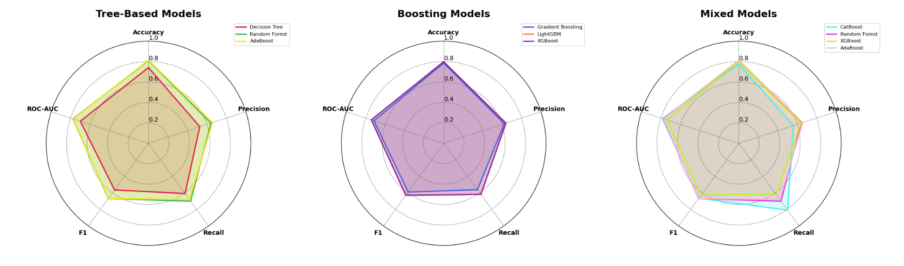

# 📌 OptiTree: Tree Model Benchmarking

> A production-ready framework that benchmarks seven tree-based classifiers on the Telco Churn dataset using Particle Swarm Optimization for automated hyperparameter tuning.

## 📖 Overview
 - This project implements a **multi-model benchmarking and optimization suite** for tree-based classifiers applied to a binary churn classification task on the Telco Customer Churn dataset.
 - Instead of grid or random search, all seven models are tuned with **Particle Swarm Optimization (PSO)** via the custom `hyperparameter-optimizer` library, enabling convergence-driven search across complex hyperparameter spaces.
 - Class imbalance in the training set is addressed with **SMOTE oversampling** before each model is trained, ensuring fair evaluation on the held-out test set.
 - **MLflow** tracks every PSO evaluation run — parameters, metrics, and model artifacts — while **joblib** serializes the winning model for immediate deployment.
 - Developed in a Jupyter notebook, the pipeline covers data ingestion, feature engineering, optimization, evaluation, and cross-model comparison in a single reproducible workflow.

## 🏢 Business Impact
Identifying customers at risk of churning is a high-stakes classification problem in telecom, finance, and subscription businesses. OptiTree provides an automated, auditable framework for selecting and tuning the best tree-based classifier without manual hyperparameter search, reducing experimentation time and improving model accuracy across all candidates. The full MLflow audit trail and serialized model artifacts mean any winning configuration can be reproduced or deployed immediately, cutting the gap between experimentation and production.

## 🚀 Features
✅ **Seven-Model Benchmark:** Decision Tree, Random Forest, AdaBoost, Gradient Boosting, LightGBM, XGBoost, and CatBoost are all optimized and compared under identical conditions.  
✅ **PSO Hyperparameter Optimization:** Particle Swarm Optimization replaces grid and random search, iteratively converging on optimal hyperparameter regions for each model.  
✅ **SMOTE Class Balancing:** Synthetic oversampling corrects the class imbalance in the training set before any model is fitted, preventing bias toward the majority class.  
✅ **MLflow Experiment Tracking:** Every PSO run logs parameters, accuracy, precision, recall, F1, and ROC-AUC to a local MLflow server for full reproducibility and cross-run comparison.  
✅ **Model Serialization:** The best-performing model and preprocessing pipeline are saved with joblib for drop-in deployment.  
✅ **Radar Chart Comparison:** A multi-axis radar chart visualizes all five metrics across all seven models simultaneously, making trade-offs between classifiers immediately visible.  

## ⚙️ Tech Stack
| Technology                  | Purpose                                                               |
| --------------------------- | --------------------------------------------------------------------- |
| `Python`                    | Primary language for the entire notebook pipeline                     |
| `scikit-learn`              | Decision Tree, Random Forest, AdaBoost, Gradient Boosting, and preprocessing pipelines |
| `LightGBM`                  | Gradient boosting with histogram-based splits                         |
| `XGBoost`                   | Extreme gradient boosting with regularization                         |
| `CatBoost`                  | Gradient boosting with native categorical feature handling            |
| `hyperparameter-optimizer`  | Custom PSO/Pattern Search library used to tune all seven classifiers  |
| `imbalanced-learn`          | SMOTE oversampling to correct class imbalance in training data        |
| `MLflow`                    | Experiment tracking — logs parameters, metrics, and model artifacts   |
| `joblib`                    | Serializes the preprocessor pipeline and trained models to disk       |
| `pandas`                    | Data ingestion, preprocessing, and feature transformations            |
| `numpy`                     | Numerical operations and array handling                               |
| `matplotlib`                | Radar chart and PSO convergence curve visualizations                  |
| `seaborn`                   | Confusion matrix heatmaps for each model                              |

## 📂 Project Structure
<pre>
📦 OptiTree - Tree Model Benchmarking
 ┣ 📂 imgs
 ┃ ┗ 📜 models_comparison.png
 ┣ 📜 OptiTree - Benchmarking Tree-Based Models with Metaheuristic Optimization.ipynb
 ┣ 📜 LICENSE
 ┣ 📜 requirements.txt
 ┗ 📜 README.md
</pre>

> **Why a single notebook?** The entire pipeline — data ingestion, feature engineering, PSO optimization, MLflow logging, and cross-model comparison — is self-contained in one notebook so each stage can be inspected and re-run interactively without switching between scripts.

## 🛠️ Installation

1️⃣ **Clone the Repository**
<pre>
git clone https://github.com/real-ahmed-moussa/opttree.git
cd optitree
</pre>

2️⃣ **Create a Virtual Environment and Install Dependencies**
<pre>
python -m venv venv
source venv/bin/activate
pip install -r requirements.txt
</pre>

3️⃣ **Start the MLflow Tracking Server**
<pre>
mlflow ui --port 5000
</pre>

4️⃣ **Launch the Notebook**
<pre>
jupyter notebook "OptiTree - Benchmarking Tree-Based Models with Metaheuristic Optimization.ipynb"
</pre>

## 📂 Model Comparison

### Radar Chart — All Seven Models Across Five Metrics

  

## 📊 Results
 - **Task:** Binary classification predicting customer churn on the Telco Customer Churn dataset (705 test samples, ~27% churn rate).
 - **Top accuracy:** AdaBoost achieved the highest accuracy at **81.4%** (Precision: 65.7%, Recall: 68.0%, F1: 66.8%, ROC-AUC: 77.3%).
 - **Best recall:** CatBoost led on recall at **80.9%**, making it the strongest candidate for minimizing missed churners (ROC-AUC: 78.5%).
 - **Ensemble models dominate:** Random Forest, AdaBoost, and LightGBM all exceeded 80% accuracy, outperforming the single Decision Tree (74.2%) by a significant margin.
 - **PSO convergence tracked:** All seven optimization runs logged PSO iteration curves, optimal hyperparameter values, and full metric suites to MLflow for reproducible comparison.

## 📝 License
This project is shared for portfolio purposes only and may not be used for commercial purposes without permission.
